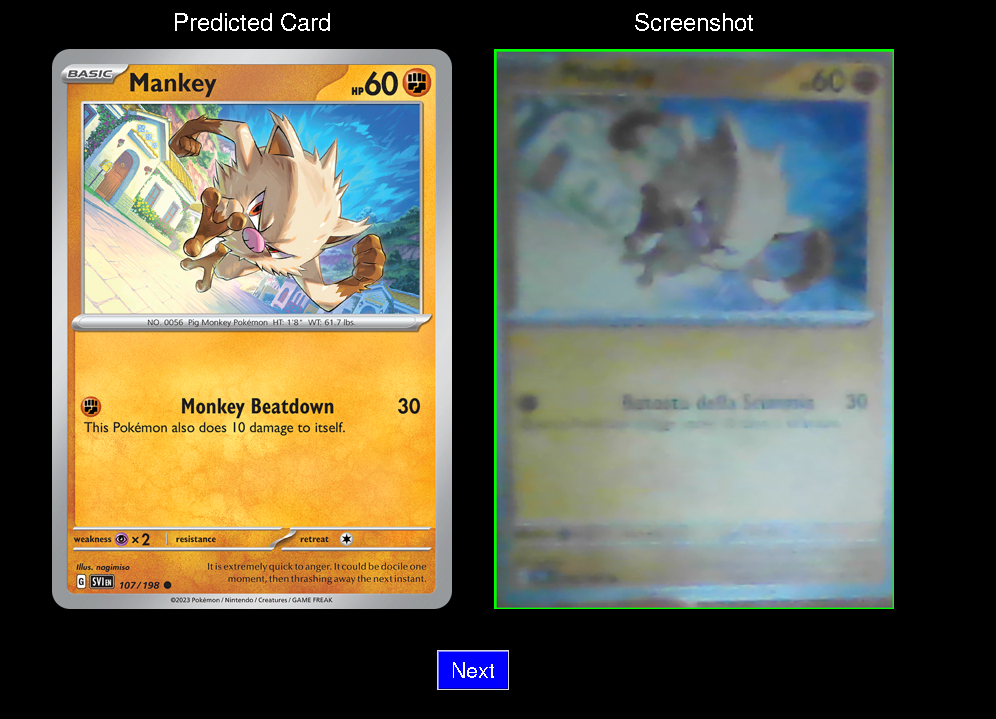

# Pokémon Card Classifier

Questo progetto utilizza un modello fine-tuned **EfficientNetB1** per riconoscere le carte Pokémon da immagini. Il modello è stato addestrato su un dataset di immagini di carte Pokémon e può classificare con precisione nuove carte catturate tramite webcam. Il progetto include anche un'interfaccia grafica per visualizzare la carta prevista accanto alla schermata catturata dalla fotocamera.

## Funzionalità

- **Classificazione delle Carte:** Utilizza un modello fine-tuned EfficientNetB1 per riconoscere le carte Pokémon.
- **Cattura Immagini:** Cattura immagini delle carte utilizzando una webcam.
- **Interfaccia Grafica:** Mostra la carta prevista e lo screenshot catturato in una finestra Tkinter.
- **Gestione dei Dati:** Supporta il salvataggio degli screenshot e la gestione dei file JSON per le informazioni sulle carte.

## Installazione

1. **Clonare il repository:**

    ```bash
    git clone https://github.com/PatricReineri/pokemon-card-classifier.git
    cd pokemon-card-classifier
    ```

2. **Installare le librerie richieste:**

    Assicurati di avere Python 3.x installato. Puoi installare tutte le librerie richieste utilizzando il file `requirements.txt` fornito nel repository:

    ```bash
    pip install -r requirements.txt
    ```

3. **Scaricare immagini e dati:**

    Prima di addestrare il modello, è necessario scaricare immagini e dati delle carte Pokémon. Usa lo script `download_set.py` per scaricare tutte le immagini e i dati necessari. Questo script salverà le immagini e i file JSON nelle cartelle appropriate:

    ```bash
    python download_set.py
    ```

4. **Addestrare il modello:**

    Una volta scaricate le immagini e i dati, puoi addestrare il modello EfficientNetB1 utilizzando lo script `card-classifier.py`. Questo genererà il file modello richiesto (`pokemon_classifier_crop_cards.pth`) e il file del label encoder (`classes.npy`):

    ```bash
    python card-classifier.py
    ```

5. **Preparare le directory:**

    - Lo script `download_set.py` creerà una cartella `base1_images` per le immagini delle carte e una cartella `base1` per i file JSON. Assicurati che queste directory siano popolate con i dati scaricati.

## Utilizzo

1. **Esegui lo script del classificatore:**

    Per iniziare a catturare immagini e classificare le carte Pokémon, esegui il seguente comando:

    ```bash
    python cam-tcgclassifier.py
    ```

2. **Cattura e Classifica:**

    Lo script aprirà la tua webcam, mostrerà un rettangolo per aiutarti a posizionare la carta e catturerà un'immagine dopo 5 secondi. Successivamente, classificherà la carta e mostrerà l'immagine della carta prevista e lo screenshot catturato in una finestra Tkinter.

    

4. **Testare il modello addestrato:**

    Puoi testare il modello addestrato utilizzando lo script `card_classifier_usage.py`. Questo script ti permette di fornire un'immagine per la classificazione e mostrerà il risultato previsto. Esegui lo script con:

    ```bash
    python card_classifier_usage.py
    ```

5. **Interagire con l'Interfaccia:**

    - **Pulsante "Next":** Clicca sul pulsante "Next" per chiudere la finestra Tkinter e iniziare una nuova cattura.

## Spiegazione del Codice

- **`download_set.py`**: Utilizzato per scaricare immagini e dati delle carte Pokémon. Salva immagini e file JSON necessari per l'addestramento e la classificazione.
- **`card-classifier.py`**: Utilizzato per addestrare il modello EfficientNetB1 e generare i file del modello e del label encoder.
- **`cam-tcgclassifier.py`**: Contiene il codice per catturare immagini utilizzando la webcam, classificare le immagini catturate con il classificatore di carte Pokémon e mostrare i risultati tramite Tkinter.
- **`card_classifier_usage.py`**: Permette di testare il modello addestrato con immagini fornite per verificare i risultati di classificazione.
- **`display_predicted_card(image_path)`**: Funzione che crea una finestra Tkinter per visualizzare la carta prevista e lo screenshot.
- **`capture_image()`**: Cattura un'immagine dalla webcam e la salva come `screenshot.png`.
- **`classify_and_show_image()`**: Classifica l'immagine catturata e visualizza il risultato.

## Contribuire

Se desideri contribuire a questo progetto, fai un fork del repository e crea una pull request con le tue modifiche. Per cambiamenti maggiori, apri prima una issue per discutere cosa vorresti cambiare.

## Licenza

Questo progetto è concesso in licenza sotto la Licenza MIT - consulta il file [LICENSE](LICENSE) per i dettagli.

## Ringraziamenti

- **[EfficientNet](https://arxiv.org/abs/1905.11946)**: Per l'architettura del modello.
- **[OpenCV](https://opencv.org/)**: Per gli strumenti di visione artificiale utilizzati per la cattura delle immagini.
